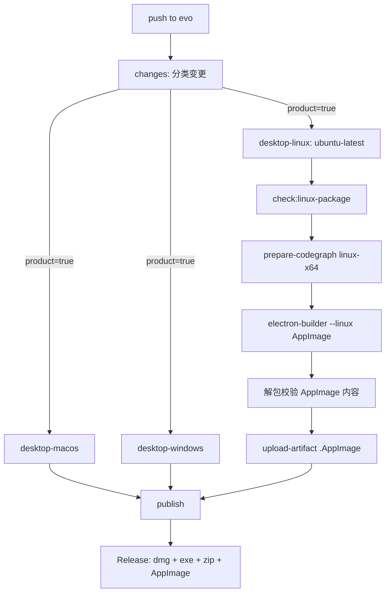
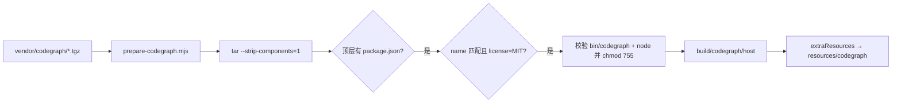

# Linux AppImage 打包技术设计

## 背景

定制版当前发布 macOS（`.dmg`）与 Windows（`.exe` / `.zip`）产物，CI 由 `desktop-macos` 与 `desktop-windows` 两个 job 构建，`publish` job 在三者齐备后创建 Release。Linux 只有 `build.linux.target = ["dir"]`，即只能产出未打包目录，无法分发。

代码层面 Linux 已被纳入平台抽象（`LinuxPlatformStrategy`、`setup-wizard-contract` 的 Linux 分支、`cordis.patch.yml` 中 `desktop-terminal` 的 Linux 禁用项），因此本设计的核心不是"让 Linux 跑起来"，而是"让 Linux 有可分发产物"，并解决 CodeGraph 在 Linux 上的供给问题。

CodeGraph 的 Linux x64 二进制不在 npm（`@colbymchenry/codegraph-linux-x64` 在 registry 中不存在），只在 GitHub Releases 提供 `codegraph-linux-x64.tar.gz`，其布局与 npm 平台包不同，无法直接通过既有校验。

## 设计目标与范围排除

**设计目标：**

- `evo` 分支的产品变更能产出 Linux x64 AppImage，且与 macOS / Windows 产物在同一次 Release 中发布
- Linux 产物包含可用的 CodeGraph CLI（`bin/codegraph` 与 `node` 均存在且可执行）
- 既有 CodeGraph 校验逻辑与许可证门禁不因新增平台而放宽
- macOS / Windows 的构建与发布行为保持不变

**范围排除：**

- 不修复 Linux 的功能降级（系统终端、应用内更新、目录选择、`advanced`/`extended` 模式、窗口材质）——这些由上游平台策略决定
- 不做 Linux arm64 产物（见决策三）
- 不引入 deb / rpm / snap 打包格式
- 不改变现有 vendor 中 darwin / win32 归档的来源与校验方式

## 技术决策

### 决策一：AppImage 的构建位置

**决策**：在 CI 新增 `desktop-linux` job，运行于 `ubuntu-latest`，与 macOS / Windows job 对称。

**理由**：
- 本地开发机是 macOS，无法产出经过真实 Linux 工具链验证的产物（AppImage 依赖 Linux 侧的 `mksquashfs`、`appimagetool` 等）
- 与既有 `desktop-macos` / `desktop-windows` 的结构一致，降低维护认知成本
- 天然复用现有缓存、依赖安装与产物上传步骤

**替代方案对比**：

| 方案 | 优势 | 劣势 | 适用场景 |
|---|---|---|---|
| CI `ubuntu-latest` job（首选） | 工具链真实、与现有 job 对称、无需本地环境 | 每轮 CI 增加一台 runner 成本 | 需要长期持续发布 |
| 本地 Docker 容器构建 | 不占 CI 资源 | 需要维护镜像、产物无 CI 背书、与现有流水线割裂 | 一次性验证 |
| 在 macOS 上交叉构建 | 无需新 job | deb/rpm 不可行，AppImage 亦依赖 Linux 工具链，结果不可靠 | 不适用 |

### 决策二：Linux CodeGraph 二进制的获取方式

**决策**：将 GitHub Releases 的 `codegraph-linux-x64.tar.gz` 适配为 npm 平台包布局，vendored 进 `vendor/codegraph/`，与既有 darwin / win32 归档同等对待。

**理由**：
- 与仓库既有 vendor 机制一致：构建离线可重复、归档带 sha256 记录、受同一套许可证门禁约束
- 避免构建期网络依赖——CI 中动态下载会让构建结果依赖外部服务的可用性与内容稳定性
- 存档进仓库后，归档内容变化可被 code review 与版本控制观察到

**替代方案对比**：

| 方案 | 优势 | 劣势 | 适用场景 |
|---|---|---|---|
| 适配后 vendored（首选） | 离线可重复、受既有门禁约束、变更可审 | 仓库体积增加约 59 MiB | 长期发布 |
| CI 运行时下载 | 仓库不变大 | 构建依赖外部网络与上游资产稳定性；无法固定内容 | 一次性验证 |
| 不提供 CodeGraph | 改动最小 | Linux 版功能进一步残缺，与 macOS/Windows 差距拉大 | 明确接受功能缺失 |

### 决策三：AppImage 的目标架构

**决策**：仅构建 x64。

**理由**：
- CI runner 与绝大多数 Linux 桌面为 x64
- 单一架构使产物名、验证脚本与 release 收集逻辑保持简单
- arm64 在 npm 上**有** `codegraph-linux-arm64`，未来若需要，新增一行的成本很低

**替代方案对比**：

| 方案 | 优势 | 劣势 | 适用场景 |
|---|---|---|---|
| 仅 x64（首选） | 覆盖面最大、实现最简 | 不含 arm64 桌面 | 当前需求 |
| x64 + arm64 | 覆盖完整 | 需交叉构建或在 arm runner 上构建，CI 成本与复杂度上升 | 有明确 arm64 用户群 |
| 仅 arm64 | 有现成 npm 平台包 | Linux 桌面占比极低 | 不适用 |

### 决策四：GitHub bundle 的适配方式

**决策**：离线做一次性转换，产出符合 npm 平台包布局的 `.tgz` 放入 `vendor/codegraph/`，**不改动** `prepare-codegraph.mjs` 的解包与校验逻辑（仅新增 `TARGETS['linux-x64']` 条目）。

**理由**：
- 校验逻辑是许可证与内容门禁的一部分，为适配一个平台而放宽或分支化会削弱门禁强度
- 转换后的归档与 darwin / win32 归档形态完全一致，后续维护只需理解一种布局
- `prepare-codegraph.mjs` 的改动被压缩到"增加一个 TARGETS 条目"，风险最小

**替代方案对比**：

| 方案 | 优势 | 劣势 | 适用场景 |
|---|---|---|---|
| 离线转换为 npm 布局（首选） | 门禁不削弱、脚本改动最小、布局统一 | 需要一次性转换步骤与产物校对 | 当前需求 |
| 扩展脚本支持双布局 | 保留上游原始归档 | 校验逻辑分支化、物化标记语义变复杂、门禁出现平台特例 | 上游布局频繁变动时 |
| 在 CI 中重排后再校验 | 无需人工转换 | 每次构建都重排，且重排步骤本身未被门禁覆盖 | 不适用 |

### 决策五：沿用现有技术栈

沿用现有：Electron + electron-builder + Cordis 插件体系 + GitHub Actions，本次不变更。AppImage 使用 electron-builder 内置的 `AppImage` target，不引入额外打包工具链。

## 时序与交互

CodeGraph 物化流程（新增 linux-x64 后）：

## 风险与应对

- **AppImage 运行依赖 FUSE2**：较新的 Ubuntu 默认只带 FUSE3，用户双击可能失败 → 文档中给出 `--appimage-extract-and-run` 兜底用法，并在 README 的 Linux 段落说明
- **electron-builder 在 ubuntu 上的额外系统依赖**：AppImage target 通常需要 `libarchive-tools` 等 → 在 CI job 中显式安装，并通过一次真实运行确认清单完整
- **Linux native 模块编译**：`fs-ext`、`koffi` 等需在 Linux 上解析 → 由 ubuntu runner 的原生工具链处理；若出现 prebuild 缺失，需在 job 中安装构建依赖
- **`verify-packaged-runtime.ts` 的平台 allowlist 改造范围未知**：其现有 allowlist 以 macOS / Windows 资产为主，Linux 资产集合需要实测确定 → 先构建一次 Linux 产物，以其真实内容为依据扩展 allowlist，而不是推测
- **转换产物与上游 bundle 的字节一致性**：适配只应改变布局与清单，不得修改二进制 → 用 sha256 比对转换前后的 `bin/codegraph` 与 `node`
- **仓库体积增长约 59 MiB**：与既有两个归档（合计约 108 MiB）同量级；GitHub 会提示大文件警告但低于 100 MiB 硬限制
- **CodeGraph 在 Linux 上的运行未经验证**：CI 为无 GUI 环境，`codegraph` CLI 本身可运行 → 在 `desktop-linux` job 中以 `--version` 或等价命令做一次冒烟验证

## 测试策略

- **单元测试重点**：`prepare-codegraph.mjs` 的 TARGETS 新增条目；未知平台仍显式失败
- **打包检查重点**：新增 `check:linux-package` 脚本，覆盖 `package.spec.ts`、`verify-packaged-runtime.spec.ts` 等与打包相关的用例
- **产物验证重点**：解包 AppImage（`--appimage-extract`）后校验 `cordis.patch.yml` 的 `enabled: false`、`lib/` 中的 `.invalid` 端点、`resources/codegraph` 的可执行文件
- **需要 Mock 的外部依赖**：无新增；转换步骤为离线操作

## 部署与发布

- **发布策略**：随 `evo` 分支的常规发布流程，无需灰度
- **回滚条件**：若 Linux job 持续失败，可临时将其从 `publish` 的 `needs` 中移除并单独修复，不阻塞 macOS / Windows 发布
