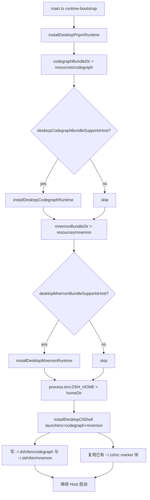
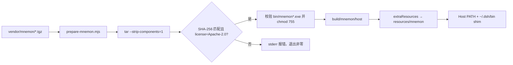
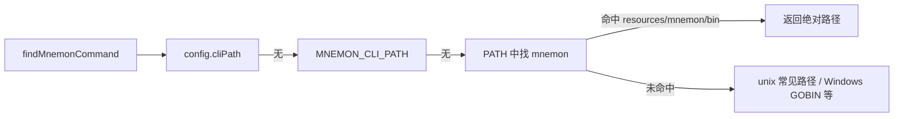

# 内置 mnemon 插件与 mnemon CLI 技术设计

## 背景

本次变更有两条互相独立、但共享同一套分发机制的线索：

1. **三个插件要成为内置预装**。`billion-context`、`dsh-mnemon`、`dsh-rewind-plugin` 目前只在用户自己 profile 的 `package.json` 里，安装包里没有、`DEFAULT_PROFILE_PLUGIN_BUNDLES` 里也没有。补齐这件事的机制仓库已经完备：`scripts/preinstall-plugins.mjs` 的 `add` 子命令会同步改写两个变体的 `dependencies` 与 `DEFAULT_PROFILE_PLUGIN_BUNDLES`，并跑 `verify-desktop-variants`、`profile.spec.ts`、`verify:licenses`、`verify:closure` 四道门禁。

2. **`dsh-mnemon` 依赖一个外部 CLI**。`dsh-mnemon-source-memory-spaces/lib/native-cli.js:85` 的 `findMnemonCommand` 按 `config.cliPath` → 环境变量 `MNEMON_CLI_PATH` → PATH 里找 `mnemon`（win32 额外尝试 `.exe` / `.cmd`）→ 若干常见安装路径的顺序查找。按目录前插 Host 进程 PATH 即可让它命中，插件侧不需要任何配置改动。

第 2 条与 CodeGraph CLI 的处境完全同构，仓库已有完整先例：`scripts/prepare-codegraph.mjs` 物化 → `build.extraResources` 打进包 → `installDesktopCodegraphRuntime` 前插 Host PATH → macOS 用 `desktop-codegraph-shell.ts` 写 `~/.dsh/bin` shim 与 `~/.zshrc` marker 块 → Windows 用 `build/installer.nsh` 写 HKCU PATH。本设计复用这条链路，并在过程中把其中「CodeGraph 专用」的部分泛化为 CLI 无关。

## 设计目标与范围排除

**设计目标：**

- 两个变体的安装包内都含 `billion-context`、`dsh-mnemon`、`dsh-rewind-plugin`，新 Profile 创建时自动进入 `bundles`
- 安装包内自带 mnemon CLI（macOS arm64 + Windows x64），应用内插件与用户终端都能解析到 `mnemon`
- shell 集成从「一个 CLI 一个模块」变为「一次登记多个 CLI」，且不产生第二段 marker 块、不需要用户改 PATH
- 既有 CodeGraph 行为、既有 7 项预装清单、既有门禁强度均不回归
- macOS universal 两个架构切片的 `resources/mnemon` 内容一致

**范围排除：**

- `billion-context` 自带的 `bili` / `bili-proxy`：本次只发布 mnemon CLI，`billion-context` 作为普通插件随包分发
- Linux：与 CodeGraph 保持一致的覆盖范围（macOS + Windows）
- 用户本机 profile 的 `billion-context` 版本：属本地状态，不在仓库变更内
- 采用尚未通过 Yarn `npmMinimalAgeGate`（默认 24h）观察期的上游版本
- 不修改 `dsh-mnemon` 的查找顺序、不写 `cliPath` 配置、不新增 `MNEMON_CLI_PATH`

## 技术决策

### 决策一：mnemon CLI 的供给方式

**决策**：与 CodeGraph 完全相同——把平台 tgz vendored 进 `vendor/mnemon/`，由 `scripts/prepare-mnemon.mjs` 物化到 `build/mnemon/host/`，再经 `build.extraResources` 打进安装包；不声明为 Yarn 依赖。

**理由**：
- 平台包 `package.json` 声明 `cpu: ["arm64"]`，而 macOS 产物是 **universal**（同一份 `.app` 里含 x64 与 arm64 两个切片）。把它作为 Yarn 依赖会让 Yarn 在 x64 切片上跳过它，两个切片内容不一致，`@electron/universal` 直接失败。CodeGraph 当初踩过这个坑，最终就是靠 `extraResources` + `x64ArchFiles` 解决的。
- vendored 归档让构建离线可重复，归档内容变化可在 code review 中被看到，且归档哈希可以写进物化标记。
- Windows 产物是 x64-only（`scripts/package-win.ts:115-116` 对非 x64 直接抛错），但 vendored 归档的覆盖范围与 macOS 对齐，将来加 Windows arm64 时只需加一条 `TARGETS` 条目。

**替代方案对比**：

| 方案 | 优势 | 劣势 | 适用场景 |
|---|---|---|---|
| vendored tgz + extraResources（首选） | 离线可重复、universal 切片一致、与 CodeGraph 同构 | 仓库体积 +12 MB；物化脚本多一份 | 当前需求 |
| `optionalDependencies` 声明平台包 | 无自定义脚本 | universal 切片不一致导致打包失败；`enableScripts: false` 下行为不可控 | 非 universal 的单架构产物 |
| CI 构建时 `npm pack` 下载 | 仓库不变大 | 构建依赖外网与上游资产稳定性，内容无法固定 | 一次性验证 |
| 要求用户自行安装 mnemon | 改动最小 | 与「内置」的需求直接冲突，插件可能整体不可用 | 不适用 |

### 决策二：shell 集成的泛化方式

**决策**：把 `desktop-codegraph-shell.ts` 原地泛化为 `desktop-cli-shell.ts`，导出面由「单 launcher」改为「launcher 列表」：`installDesktopCliShell({ homeDir, userHomeDir, launchers: [{ name, launcherPath }, ...] })`。文件名与导出名一并改，不留 `codegraph` 字样的兼容别名。

**理由**：
- 两个 CLI 共用同一个 `~/.dsh/bin` 与同一段 PATH 块，因此天然是「一次调用登记 N 个 shim」，而不是「两个模块各自登记」——后者需要处理两个模块同时改写同一段 marker 块的竞争，并且很难保证 `changed` 语义与备份次数正确。
- 模块的契约确实变了（一个 CLI → N 个 CLI），继续叫 `desktop-codegraph-shell` 会让调用方与读者误判职责。仓库内部仅有 `main.ts` 与一个 spec 引用它，改名成本可控。
- 校验、原子写、备份、相对 `$HOME` 缩写这些既有逻辑一字不改地复用，只是把循环套在 launcher 列表外层。

**替代方案对比**：

| 方案 | 优势 | 劣势 | 适用场景 |
|---|---|---|---|
| 原地泛化为多 launcher 模块（首选） | 一份 marker 块、一份备份逻辑、`changed` 语义清晰 | 需要改名并同步 spec | 当前需求（多个 CLI 共目录） |
| 复制出 `desktop-mnemon-shell.ts` | 不动既有文件与测试 | 两个模块改写同一段 marker 块，互相覆盖对方的 shim 目录判断；备份文件翻倍；启动顺序影响结果 | 各 CLI 使用不同目录时 |
| 保持单 launcher，调用两次 | 改动最小 | 第二次调用找不到自己「拥有」的块语义，卸载时不知道删哪个 shim；`uninstall` 会连带删掉另一个 CLI 的 shim | 不适用 |

### 决策三：marker 块的文本

**决策**：**保留**现有文本 `# >>> dsh-desktop codegraph >>>` / `# <<< dsh-desktop codegraph <<<`，不改名、不做迁移。

**理由**：
- 已有的用户机器（含本机）`~/.zshrc` 里已经存在这段块，块内容正是 `export PATH="$HOME/.dsh/bin:$PATH"`——新方案要写进去的内容与它逐字节相同。
- 改文本会让 `applyProfileBlock` 找不到旧块，于是追加出第二段块，同时在用户家目录多留一个 `.dsh-backup-*` 文件；用户看到的是一段功能完全重复的 PATH 导出，属于纯粹的负面变化。
- 保持文本意味着**已有用户零改动、零备份、零重复**：新一轮启动发现块内容一致，`changed` 保持 `false`。

代价是注释里仍写着 `codegraph` 而实际服务两个 CLI。这属于可接受的措辞问题：它是一段面向机器的 marker，不是用户文档；把「为何保留历史文本」记在本设计与代码注释里，比在用户家目录制造重复块更重要。将来若确实要改名，应作为一次显式的迁移（识别旧块 → 原地替换文本 → 不新增块），而不是顺手改常量。

**替代方案对比**：

| 方案 | 优势 | 劣势 | 适用场景 |
|---|---|---|---|
| 保留 `codegraph` 文本（首选） | 已有用户零改动；不产生重复块与多余备份 | 注释措辞与实际职责不符 | 当前需求 |
| 改为 `dsh-desktop cli` 并迁移旧块 | 措辞准确 | 需要实现一段一次性迁移逻辑并为其写测试；迁移失败会留下重复块 | 明确要做一次品牌化整理时 |
| 改为 `dsh-desktop cli` 不迁移 | 实现最简 | 每个已有用户多一段重复 PATH 块 + 一个备份文件 | 不适用 |

### 决策四：Windows 的 PATH 登记方式

**决策**：在 `build/installer.nsh` 里为 mnemon **新增一组与 codegraph 对称的分支**（各自的 define、各自的 `FileExists` 判断、各自的后缀匹配），而不是把 codegraph 分支改造成循环或合并成一个 define。

**理由**：
- NSIS 宏里的 `ReadRegStr` / `${StrContains}` / 追加 / 备份 / 广播是一条带状态的操作链，抽成循环需要在 NSIS 里做字符串数组，可读性与可维护性都会显著变差。
- 两个 CLI 目录不同（`resources\codegraph\bin` 与 `resources\mnemon\bin`），卸载时要分别判断「是否仍是最后一项」，对称的两段分支比参数化更直白。
- 既有 `installer-nsh.spec.ts` 断言 `WriteRegExpandStr HKCU "Environment" "Path"` **恰好出现两次**。新增一组分支后该断言必然变化——本设计把断言更新为「恰好四次，且两对分别针对两个目录」，而不是放宽成「至少两次」。这个数字本身就是防止重复追加的保护。

**替代方案对比**：

| 方案 | 优势 | 劣势 | 适用场景 |
|---|---|---|---|
| 两组对称分支（首选） | 直白、卸载判断各自独立 | 脚本变长；测试断言需同步 | 当前需求（两个 CLI） |
| 参数化成一个 `!macro DSH_REGISTER_PATH_CLI` | 无重复代码 | NSIS 宏参数与 `${StrContains}` 的拼接容易出错；调试成本高 | CLI 数量继续增长时 |
| 只登记一个父目录 | 改动最小 | `resources\codegraph\bin` 与 `resources\mnemon\bin` 不在同一父目录下；把它们合并需要搬动打包布局，影响既有安装 | 不适用 |

### 决策五：三个插件作为直接依赖

**决策**：把三个插件写进两个变体的 `dependencies`（不是 `optionalDependencies`，不是 devDependencies），并同步进 `DEFAULT_PROFILE_PLUGIN_BUNDLES`。

**理由**：
- `scripts/preinstall-plugins.mjs:commandList` 的一致性检查是单向的：清单里的名字必须能在 `dependencies` 里找到。只进清单不进依赖会立刻产生告警。
- `DEFAULT_PROFILE_PLUGIN_BUNDLES` 的语义是「新 Profile 创建时把名字写进 `bundles`，版本取安装包内依赖的版本」。因此依赖是分发的载体、清单是启用的开关，两者必须同时存在。
- 三个插件的 peer 依赖已全部在 `dsh-plugin-desktop` 的依赖树内被满足（`dsh-rewind-plugin` 的 15 个 peer 全在；`dsh-mnemon` 的 first-party peer 全在，`react` 在 dependencies，`react-dom` 仅在 devDependencies——但 `verify:closure` 只校验 `@deepseek-ai/` 前缀的 first-party peer，且已内置的 `dsh-better-sidebar` 是完全相同的形状）。因此提升 `react-dom` 到 dependencies **不在本次范围内**：那会扩大安装包而不改善任何门禁。

**替代方案对比**：

| 方案 | 优势 | 劣势 | 适用场景 |
|---|---|---|---|
| 直接依赖 + 清单（首选） | 满足既有门禁语义，与其余 7 项一致 | 安装包体积增加 | 当前需求 |
| `optionalDependencies` | 理论上可跳过 | 清单一致性检查读的是 `dependencies`；且「可跳过」会让新 Profile 声明一个装不上的插件 | 不适用 |
| 只进清单、依赖交给用户 | 仓库最干净 | 新 Profile 声明了装不上的插件，应用启动即报错 | 不适用 |

### 决策六：沿用现有技术栈

沿用现有：Electron + electron-builder + Cordis 插件体系 + Yarn 4（`nodeLinker: node-modules`）+ Vitest。本次不引入任何新的构建工具、打包格式或运行时依赖。`prepare-mnemon.mjs` 与 `prepare-codegraph.mjs` 一样是仓库根 `scripts/` 下的独立 Node ESM 脚本，不进入 Yarn workspace 依赖图。

## 时序与交互

启动期（macOS）：

物化流程：

查找落地（插件侧，多级回退）：

## 风险与应对

- **`prepare-mnemon.mjs` 的平台包清单形状与 CodeGraph 不同**：mnemon 平台包的 `package.json` 中 `name` 是**主包名** `@mnemon-dev/mnemon`（不是带后缀的平台包名），`version` 才是带后缀的 `0.2.9-darwin-arm64`。照抄 codegraph 的「断言 name 等于平台包名」会直接失败 → 脚本显式断言 `name === '@mnemon-dev/mnemon'` 且 `version === '0.2.9-<targetKey>'`，并在 `TARGETS` 的注释里写明这一差异。
- **license 门禁被绕过**：`extraResources` 里的内容不进入 `verify:licenses` 的扫描范围（它只扫 `node_modules` 的 production manifest），CodeGraph 的应对方式是在物化脚本里硬断言 `EXPECTED_LICENSE` → mnemon 同样在 `prepare-mnemon.mjs` 中断言 `Apache-2.0`（该值确实在 `ALLOWED_LICENSES` 内），使分发前必然经过一次许可证检查。
- **macOS universal 切片不一致**：只有在 `build.mac.x64ArchFiles` 里声明 `Resources/mnemon/**` 才能让两个切片保持同一份资源 → 打包脚本与 `package.spec.ts` 都要覆盖这一点；缺失时的表现是 `@electron/universal` 报资源差异错误，属于快速失败而非静默错误。
- **`~/.zshrc` 被写坏**：既有实现已经用原子写 + `.dsh-backup-*` 保护；泛化时保留这两点，并把「第二次调用 `changed === false`」与「marker 块只出现一次」写成 spec 场景。
- **marker 块与已有用户的块内容不一致**：本设计选择保留块文本，且块内容不变，因此已有用户不会被改写。若将来有人改了 `MARKER_BEGIN` 常量，就会出现重复块 → 在代码注释中写明该常量的兼容性含义。
- **`installer-nsh.spec.ts` 的「恰好两次」断言**：新增分支会打破它，必须同步更新为「恰好四次」并分别校验两个目录，否则测试会误报为回归。
- **打包脚本字符串断言**：`package.spec.ts` 逐字符断言五个打包脚本内容，前缀追加 `node ../scripts/prepare-mnemon.mjs && ` 必须同步更新断言，否则测试失败。
- **`dsh-mnemon` 在 PATH 命中之外还需要 CLI 可执行**：`mnemon` 是自包含 Go 二进制，实测 `--version` 输出 `mnemon version 0.2.9`，不依赖 Node，也不涉及 Electron 的 hardened runtime / JIT entitlement 问题（CodeGraph 因为内嵌 Node 才需要额外关注）→ 无需新增 entitlements。
- **体积增量**：darwin-arm64 tgz 6.0 MB、win32-x64 tgz 5.4 MB；未压缩的单个 Mach-O 约 15.5 MB。相比 CodeGraph 让 DMG 增加约 54 MB，本次增量小一个量级，不需要为此调整发布说明的重点。

## 测试策略

- **单元测试重点**：
  - `desktop-cli-shell.spec.ts`（由 `desktop-codegraph-shell.spec.ts` 改名并扩展）：多 launcher 一次登记、marker 块唯一、重复调用 `changed === false`、备份只生成一次、卸载移除全部 shim、bash 走 `.bash_profile`
  - `desktop-runtime-environment.spec.ts`：`installDesktopMnemonRuntime` 的 darwin/win32 分支、可执行缺失即抛错、`dispose()` 后 PATH 逐字符还原；`desktopMnemonBundleSupportsHost` 的清单缺失/非法 JSON/架构不匹配
  - `installer-nsh.spec.ts`：`WriteRegExpandStr HKCU "Environment" "Path"` 恰好四次、两个目录各自的 `FileExists` 与 `${StrContains}` 判断、卸载的末尾位置判断、不出现 `setx`
  - `package.spec.ts`：五个打包脚本字符串、`extraResources` 深比较、`x64ArchFiles` 包含 `Resources/mnemon/**`
  - `profile.spec.ts` / `profile-manager.spec.ts`：清单含新增三项、按字母序、新建 Profile 的 `bundles` 含三项
- **打包检查重点**：`check:layout`、`check:desktop-variants`（两个变体 `src/` 逐字节一致）、`verify:licenses`、`verify:closure`
- **需要 Mock 的外部依赖**：无新增。`prepare-mnemon.mjs` 的测试通过临时目录与伪造归档驱动，不访问网络
- **手工验证**：macOS 上跑一次构建后的应用，确认 `~/.zshrc` 未被改写、`~/.dsh/bin/mnemon` 生成且 `mnemon --version` 在新终端可用；Windows 的注册表行为需在原生 Windows 主机确认（与 CodeGraph 相同的待验证状态）

## 部署与发布

- **发布策略**：随既有 macOS / Windows 产物发布，无需灰度。新装用户自动获得三项能力；升级用户因安装包内容变化同样获得，已有 Profile 的 `bundles` 不会被追溯修改（这是 `DEFAULT_PROFILE_PLUGIN_BUNDLES` 的既有语义）。
- **回滚条件**：若 `prepare-mnemon.mjs` 在打包机上失败，可临时从五个打包脚本前缀中移除它并同时去掉 `extraResources` 条目，回到「三插件内置、mnemon CLI 不内置」的状态而不阻塞发布；三个插件的依赖与清单是独立的一条线，可分别回滚。
