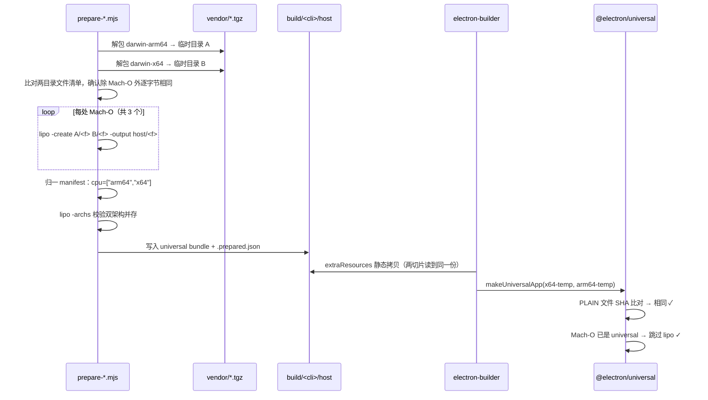

# macOS Universal 产物内置 CLI 技术设计

## 背景

macOS 安装包以 universal 构建（`scripts/package-mac.ts:135`、`scripts/release-mac.ts:105` 传 `--universal`），单个 `.app` 含 x64 与 arm64 两个切片。CLI 通过 `build.extraResources` 从 `build/codegraph/host`、`build/mnemon/host` 静态拷入 `Contents/Resources/codegraph`、`Contents/Resources/mnemon`（`dsh-plugin-desktop/package.json:343-351`）。

`vendor/` 长期只有 darwin-arm64 归档，两个切片共用同一份 arm64 资源。Intel Mac 上 `process.arch === 'x64'` 与资源清单的 `cpu: ["arm64"]` 不匹配，`bundleSupportsHost()`（`desktop-runtime-environment.ts:619-634`）返回 false，`publishBundledCliRuntime()`（`:699-713`）静默返回空对象，`main.ts:751` 的 `launchers.length > 0` 判据不成立，**`~/.dsh/bin` 因此从未创建**——这就是用户观察到的现象。

为什么现在做：上游 npm 已发布两个 darwin-x64 归档（`@colbymchenry/codegraph-darwin-x64@1.6.0`、`@mnemon-dev/mnemon@0.2.9-darwin-x64`），补齐所需的外部条件已经具备。

## 设计目标与范围排除

**设计目标：**
- Intel Mac 上 `~/.dsh/bin` 被创建，`codegraph` 与 `mnemon` 可从终端与 Host 解析
- universal bundle 中的 CLI 在 arm64 原生与 x86_64（含 Rosetta）下均能执行并返回正确版本号
- 两个构建切片的 `Contents/Resources/codegraph/**` 与 `Contents/Resources/mnemon/**` **逐字节相同**，满足 `@electron/universal` 约束
- `build.extraResources` 配置、`process.resourcesPath` 运行时路径、`bundleSupportsHost()` 判定逻辑均不变更
- macOS DMG 体积增量 ≤ 60 MB

**范围排除：**
- Linux 平台（由 `20260921191517-linux-appimage` feature 处理，本次不触碰）
- 代码签名与公证路线（当前为未签名 DMG；`docs/bundle-codegraph-cli.zh.md:397` 已列为长期风险）
- CLI 版本升级（仍取 1.6.0 / 0.2.9）
- `MACOS_UNIVERSAL_NATIVE_ENTRIES` 白名单扩充（`scripts/mac-universal.ts:9`，只覆盖 sharp/koffi/ripgrep 等既有条目）

## 技术决策

### 决策一：分发形态用 lipo 合成的单份 universal bundle

**决策**：在 prepare 阶段把 arm64 与 x64 两份归档的 Mach-O 用 `lipo -create` 合并，产出**一份** universal bundle 放到 `build/<cli>/host`。`extraResources` 与运行时路径完全不变。

**理由**：
- `@electron/universal` 对**所有非 Mach-O 文件**（`AppFileType.PLAIN`）逐个比对 SHA，不同即抛错且 `x64ArchFiles` 无法豁免（`node_modules/@electron/universal/dist/cjs/index.js:104-116`）。两个平台的包其 `package.json` 与 `README.md` 内容**确实不同**（实测 `diff`：codegraph 的 `name` 与 mnemon 的 `version` 都带架构后缀，`cpu` 数组分别为 `["arm64"]` / `["x64"]`），所以「两切片各拷一份」必然导致合并失败。
- `x64ArchFiles` 的语义是「允许两边是**同一份** x64 二进制」（`:129-136` 只在两边 SHA **相同**时放行），不是「允许两边不同」——这是本项目文档 `docs/bundle-codegraph-cli.zh.md:393` 记录的那次构建失败的根因，现有设计注释里「A static extraResources copy keeps both slices byte-identical」正是为此。
- 保持单份静态拷贝意味着**构建配置与运行时逻辑零改动**：`extraResources` 不动、`main.ts:700`/`:711` 的路径不动、`bundleSupportsHost()` 靠 manifest 的 `cpu: ["arm64","x64"]` 自然通过。
- 体积最优：非二进制部分（`lib/dist` 73 MB、`lib/node_modules` 56 MB）在两架构间共享，只有 Mach-O 翻倍。

**替代方案对比**：

| 方案 | 优势 | 劣势 | 适用场景 |
|------|------|------|---------|
| 单份 universal（lipo 合并）（**首选**） | 构建配置与运行时零改动；各保留自身签名（`codesign --verify --arch` 双通过）；体积增 +174.5 MB | 引入 `lipo` 这一 macOS 专有工具依赖 | 本项目现状：universal 产物 + 静态 extraResources |
| 双份嵌套 `host/arm64` + `host/x64`，运行时按 `process.arch` 选目录 | 实现直白，无需 lipo | 体积 +348 MB（近一倍）；`extraResources` 与运行时路径都要改；`x64ArchFiles` 规则要重写；两切片必须各带齐两份才字节相同，容易配错 | 两架构产物差异大到无法合并时 |
| 放弃 universal，每架构单独出 DMG | 每份 DMG 最小，逻辑最干净 | 改发布流水线（产物 1 → 2）；CI 与签名流程返工；偏离本仓库既定的 universal 路线 | 长期不再支持 Intel 时的简化 |

### 决策二：lipo 合并在 prepare 脚本内完成，而非 afterPack 钩子

**决策**：在 `scripts/prepare-codegraph.mjs` / `scripts/prepare-mnemon.mjs` 新增 `darwin-universal` target，把两份 vendor 归档解包后合并，产出 universal bundle 到 `build/<cli>/host`。

**理由**：
- prepare 阶段在 electron-builder 之前运行，产出的 bundle 就是最终被拷入 `Contents/Resources` 的内容——**两个切片读到的是同一份文件**，字节相同这一约束在源头就成立了。
- `afterPack` 在打包**之后**运行，而 universal 构建会分别 pack 出 `${appOutDir}-x64-temp` 与 `${appOutDir}-arm64-temp` 再合并（`app-builder-lib/out/macPackager.js` 的 `doUniversalPack`），此时两个 temp 目录已生成，钩子需要分别处理并保证结果一致，复杂度反而更高。
- prepare 脚本已有 target 机制（`TARGETS` 表、`--target` 参数、`.prepared.json` 幂等标记），扩展成本低。

**替代方案对比**：

| 方案 | 优势 | 劣势 | 适用场景 |
|------|------|------|---------|
| prepare 脚本内合并（**首选**） | 两切片在源头即读同一份文件；复用既有 target 机制；产物可离线校验 | 合并逻辑与解包逻辑耦合在同一脚本 | 本项目：CLI 已在 prepare 阶段materialize |
| `afterPack` 钩子内合并 | 与 electron-builder 生命周期贴合 | 需处理两个 temp 目录并保证结果一致；`doUniversalPack` 之后文件已固定，改动时机晚 | 资源无法在 prepare 阶段确定的场景 |
| 提交已合并的 universal 产物到仓库 | 构建零依赖 lipo | 仓库体积翻倍（+174 MB 二进制进 git）；失去 vendor 归档的可追溯性 | 不适合本项目 |

### 决策三：darwin 平台默认 target 改为 universal，不改调用点

**决策**：两个 prepare 脚本在未传 `--target` 且宿主平台为 `darwin` 时解析为 `darwin-universal`；Windows 保持按宿主架构推断。`package.json` 中的 10 处调用点**不改**。

**理由**：
- 调用点共 10 处（两个变体各 5 处：`package:dir`、`dist:mac`、`dist:mac-smoke`、`dist:win`、`dist:win-portable`），另有 10 处测试字符串断言（`tests/package.spec.ts:840-849` 与 beta 对应行）逐字比对命令串。改调用点需同改 20 处，且 beta / stable 双份容易漏改。
- 改默认推断只需动 2 个脚本文件，且行为对所有调用点一致生效。
- 副带修掉 Intel 主机上本地构建直接失败的问题：原先推断出 `darwin-x64` 而 vendor 无此归档，`locateArchive()` 报 `no vendored archive for darwin-x64`（`prepare-codegraph.mjs:110`）。

**替代方案对比**：

| 方案 | 优势 | 劣势 | 适用场景 |
|------|------|------|---------|
| 改默认 target 推断（**首选**） | 只改 2 个文件；所有调用点自动生效；无遗漏风险 | 默认行为与 `process.arch` 解耦，读代码时需留意 | 平台默认值本身就该统一时 |
| 10 处调用点显式传 `--target darwin-universal` | 调用点自解释，意图最明确 | 需同改 20 处字符串（含测试断言）；beta/stable 双份易漏 | 各调用点确实需要不同 target 时 |
| 保持推断，仅补 darwin-x64 归档让推断能跑通 | 改动最小 | Intel 主机上会产出「两切片各含自己架构」的不一致产物，universal 合并失败 | 不适用 |

### 决策四：manifest 归一为 `cpu: ["arm64","x64"]`

**决策**：合成 universal bundle 时改写 `package.json`，把 `cpu` 数组设为同时含两个架构，并按 CLI 特性调整 `name` / `version` / `description` 中的架构字样。

**理由**：
- `bundleSupportsHost()`（`desktop-runtime-environment.ts:628-631`）的 `allows()` 判据是 `value.some(entry => entry === current)`，只有数组同时含 `arm64` 与 `x64` 时两个架构才都通过。
- 两个包的 manifest 结构不同：codegraph 的架构信息在 **`name`**（`@colbymchenry/codegraph-darwin-arm64`），mnemon 的在 **`version`**（`0.2.9-darwin-arm64`）。归一化需分别处理，不能一刀切。
- `prepare-codegraph.mjs:147` 断言 `manifest.name === target.packageName`，`prepare-mnemon.mjs:150-158` 断言 `name === '@mnemon-dev/mnemon'` 且版本后缀匹配 target key——新 target 的校验逻辑要相应放宽为「name 前缀正确 + cpu 含双架构」。

**替代方案对比**：

| 方案 | 优势 | 劣势 | 适用场景 |
|------|------|------|---------|
| 改写 manifest 为双架构（**首选**） | 复用既有 `bundleSupportsHost()` 判据，运行时代码零改动 | 产出的 manifest 与上游原版不同，需在 `.prepared.json` 记录来源 | 期望运行时判定逻辑不变 |
| package.json 里删掉 `cpu` 字段 | 同样能通过 `allows()`（空数组视为不限） | 丢失架构声明，未来无法据此诊断；语义上不诚实 | 不适用 |
| 改 `bundleSupportsHost()` 支持架构数组回落 | 可保留上游 manifest 原样 | 动了运行时代码，且判定语义变复杂；当前逻辑已正确处理数组 | 需要支持更多平台组合时 |

### 决策五：沿用现有构建工具链，不引入新依赖

**决策**：沿用现有：Node.js `^22.19.0` / `>=24.0.0`、Yarn 4.18.0（Corepack）、electron-builder（工作区内 `app-builder-lib` / `electron-builder`）、`@electron/universal` 2.0.3，本次不变更。lipo 使用系统自带 `/usr/bin/lipo`（Xcode Command Line Tools 提供，macOS 打包本身已要求）。

**理由**：
- 仓库既有 universal 链路已在用 `lipo`：`scripts/verify-mac-smoke.ts:117-118` 就调 `lipo <exe> -verify_arch x86_64|arm64` 校验主可执行文件。本次只是把同一工具前移到 prepare 阶段，未新增外部依赖。
- 不引入 `@electron/universal` 之外的新 npm 包，避免许可证审计与依赖方向检查（`verify-licenses.mjs`、`market-dependency-direction.mjs`）返工。

**替代方案对比**：

| 方案 | 优势 | 劣势 | 适用场景 |
|------|------|------|---------|
| 系统 `lipo`（**首选**） | 零新增依赖；仓库已在用；签名天然按架构保留 | macOS 专有，非 macOS 主机无法合成（但非 macOS 主机本就构建不了 macOS 产物） | 本项目：macOS 产物只在 macOS 上构建 |
| 引入 npm 上的 Mach-O 合并库 | 跨平台 | 新增依赖与许可证面；与既有 `lipo` 校验链路重复 | 需要在 Linux CI 上交叉合成 macOS 二进制时 |

## 数据模型

`.prepared.json` 的字段变化（两个 CLI 一致）：

```jsonc
{
  "target": "darwin-universal",          // 新增取值
  "packageName": "@colbymchenry/codegraph-darwin-x64",  // codegraph 取 x64 侧身份
  "version": "1.6.0",
  "archive": "vendor/codegraph/colbymchenry-codegraph-darwin-x64-1.6.0.tgz",
  "archiveSha256": "...",                // x64 归档的 sha256（幂等复用判据）
  "entryPoint": "dsh-plugin-desktop/build/codegraph/host/bin/codegraph"
}
```

`darwin-universal` 需要**两份**源归档，`prepare-mnemon.mjs` 的 `TARGETS` 条目相应改为可声明多个归档：

| target | 源归档 | sha256 |
|---|---|---|
| `darwin-arm64` | `mnemon-darwin-arm64-0.2.9.tgz` | `004d6454625db1e880d83da057a801f9ec87fd08654af715d5d906ea1b2d464a`（既有） |
| `darwin-x64` | `mnemon-darwin-x64-0.2.9.tgz` | `cbdc4053f889008d34c831888420132fcfe367578b120f660bbf90252c02eb9d`（新增钉值） |
| `darwin-universal` | 上述两份 | 分别校验 |
| `win32-x64` | `mnemon-win32-x64-0.2.9.tgz` | `10e2d8d9e5f93d185018495b5c4822715bd0ad16873202f6d3b1a7696d6f69ef`（既有） |

codegraph 侧不钉 sha256（沿用现状，`prepare-codegraph.mjs` 只用 `.prepared.json` 做幂等复用判据）。

## 接口设计

新增 CLI 参数取值（不新增参数）：

```
node scripts/prepare-codegraph.mjs --target darwin-universal
node scripts/prepare-mnemon.mjs   --target darwin-universal
```

待合并的 Mach-O 清单（实测确认，两包合计 3 处）：

| CLI | 路径 | arm64 大小 | x64 大小 | 合并后 |
|---|---|---|---|---|
| codegraph | `node` | 120,573,328 | 122,894,848 | 243,486,096 |
| codegraph | `lib/kernel/codegraph-kernel.node` | 35,267,056 | 35,259,940 | 70,541,808 |
| mnemon | `bin/mnemon` | 15,519,186 | 16,308,816 | 31,837,650 |

`bin/codegraph` 是 POSIX shell 脚本（非 Mach-O），两架构内容相同，不参与合并。

## 时序与交互



关键点：`@electron/universal` 在 `:121-126` 检测到两边都已是 universal Mach-O 时直接 `continue` 跳过合并，不再走 SHA 比对分支，因此不会触发 `x64ArchFiles` 报错。

## 风险与应对

- **PLAIN 文件在两份归档间存在差异** → 实测需处理的差异仅 `package.json`（codegraph 的 `name`、mnemon 的 `version`）与 mnemon 的 `README.md`。合并前先比对文件清单，差异超出预期清单即失败，不静默继续。
- **`lipo` 合并破坏代码签名** → 已实测：合并后 `codesign --verify --strict --arch x86_64` 与 `--arch arm64` 均通过（node 保留 TeamIdentifier `H7739G8FX`）。当前为未签名 DMG 路线，`resetAdHocDarwinSignature: true`，风险面小。
- **合并后二进制在某个架构下运行失败** → 已实测：`./uni/bin/codegraph --version` 返回 `1.6.0`（arm64 原生）与 `1.6.0`（`arch -x86_64` Rosetta）；`uni-mn/bin/mnemon --version` 返回 `mnemon version 0.2.9`（两架构均通过）。实现阶段仍需在 `check:mac-package` 中加双架构断言防回归。
- **`prepare-codegraph.mjs:147` 的 name 断言会拒绝 universal manifest** → 新 target 的校验放宽为「name 前缀正确 + cpu 含双架构 + license 匹配」，不放松 license 校验（`MIT` / `Apache-2.0` 仍强制）。
- **DMG 体积超预期** → 按仓库实测压缩比 0.322（`docs/bundle-codegraph-cli.zh.md:378`）推算 +56 MB。实现后以 `dist:mac-smoke` 实测 DMG 大小复核；若显著超出，评估是否改用决策一的备选方案二。
- **Intel 主机上无 lipo** → macOS 打包已要求 Xcode Command Line Tools（既有 `verify-mac-smoke.ts` 就调 lipo），不构成新增前置条件。
- **`20260921191517-linux-appimage` 与本次同时改 `prepare-codegraph.mjs`** → 本次只加 `darwin-universal` target 与 darwin 默认推断，不触碰 `TARGETS` 中的 linux 相关条目与其校验分支。

## 测试策略

- **单元测试重点**：
  - `--target darwin-universal` 在缺少 darwin-x64 归档时以非零退出码失败，错误信息指明缺失架构
  - darwin 平台默认 target 解析为 `darwin-universal`；Windows 平台仍为 `win32-x64`；显式 `--target win32-x64` 覆盖默认推断
  - manifest 归一后 `cpu` 同时含两架构，且 `bundleSupportsHost()` 对 `darwin`/`arm64` 与 `darwin`/`x64` 均返回 true
  - 既有 `desktopCodegraphBundleSupportsHost` / `desktopMnemonBundleSupportsHost` 测试（`tests/desktop-runtime-environment.spec.ts:697`、`:813`）保持通过
- **集成测试重点**：
  - `yarn workspace dsh-plugin-desktop check:mac-package` 全量通过（含 `tests/package.spec.ts` 对 `extraResources` 与 `x64ArchFiles` 的断言）
  - `dist:mac-smoke` 端到端产出 DMG，且产物中 `Resources/codegraph/node`、`Resources/mnemon/bin/mnemon` 经 `lipo -archs` 含双架构
  - 两个变体均验证：`corepack yarn check:desktop-variants`（按 `CLAUDE.md` 要求，beta 先行再同步 stable）
- **需要 Mock 的外部依赖**：`lipo` 与 `tar` 调用需可注入（沿用现有 `spawnSync` 模式），使单测无需真实 macOS 工具链即可覆盖失败分支

## 部署与发布

- **功能开关**：无。产物本身即开关——universal bundle 落地后两架构同时生效。
- **发布策略**：灰度/全量均不适用，随下次正常 macOS 版本发布。Intel 用户升级到该版本后即获得 CLI。
- **回滚条件**：若 `dist:mac-smoke` 或 `check:mac-package` 在 CI 上失败，或实测 DMG 体积超出 +60 MB 预算过多，回滚到仅 arm64 的旧 vendor 集合（保留 darwin-x64 归档与 target 定义，只把默认推断改回宿主架构）。
- **兼容性**：已安装的 arm64 用户不受影响——其 `~/.dsh/bin` 与 `.zshrc` 标记块保持不变，CLI 内容从 arm64 单架构变为 universal，命令行行为一致。
