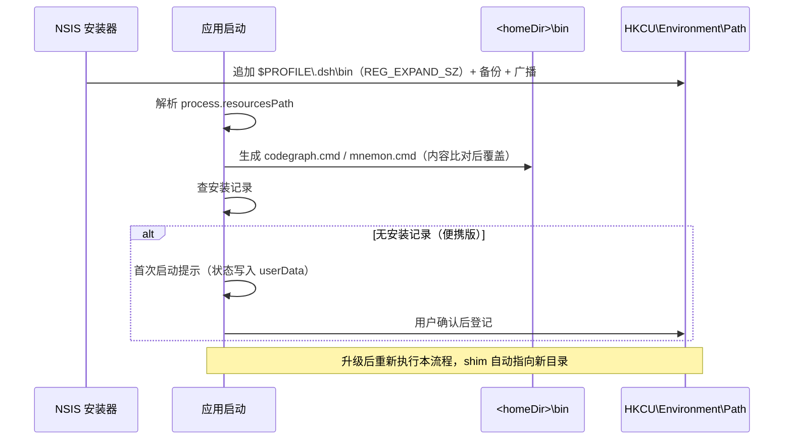

# Windows 终端 CLI 统一 shim 设计

## 背景

Windows 上把 `codegraph` / `mnemon` 暴露到用户终端的做法与 macOS 完全不同：mac 由 `desktop-cli-shell.ts` 在启动时生成转发 shim 并写 shell profile，Windows 则由 NSIS 安装器把**安装目录下的两个 bin 子目录**分别写进 `HKCU\Environment\Path`（`installer.nsh:104-163`）。这套做法有三个后果：便携版因为 electron-builder 不注入 portable include 而完全没有安装钩子，终端里不可用；安装目录被当作 PATH 目录，遇到 `C:\Program Files` 不可写、升级时 `RMDir /r $INSTDIR`（`uninstaller.nsh:187`）清空、卸载残留死条目三类问题；两个平台维护两套模型。

mac 的模型已经验证过：`~/.dsh/bin` 里只有 172–178 字节的转发脚本，真实二进制留在 app bundle 内，因此升级后 shim 自动指向新版。本次把 Windows 收敛到同一模型。

## 设计目标与范围排除

**设计目标：**
- Windows 安装版与便携版使用**同一个** shim 目录（`<homeDir>\bin`，默认 `%USERPROFILE%\.dsh\bin`）和**同一条** PATH 条目，用户 PATH 中本产品的条目数从 2 条降为 1 条。
- shim 生成是**自愈**的：不依赖版本号比较、不依赖"是否首次启动"、不依赖安装形态判断，仅由"盘上内容 ≠ 期望内容"触发重写。安装目录变更、原地升级、便携版更换解压位置四种场景全部自动修正。
- PATH 写入**必须**保持 `REG_EXPAND_SZ`；`setx` 与 `reg.exe` 两条路径都被排除。
- shim 生成失败**不得**阻断启动（沿用 `mnemon-cli-bundling-spec.md` 已有的「发布失败不阻断启动」约定）。

**范围排除：**
- `dsh` 命令不搬入统一目录。它是 per-profile 的（`desktop-cli.ts:43-56` 的 `takeDefaultProfile` 读 `DSH_DESKTOP_DEFAULT_PROFILE`），全局单份 shim 会破坏多 profile 隔离；mac 侧 `~/.dsh/bin` 里同样没有 `dsh`。
- 不改 Linux 行为（由 `20260921191517-linux-appimage` feature 处理）。
- 不改 macOS 的 shim 内容、`~/.zshrc` 块、marker 文本。
- 不改 `build.extraResources` 与 `process.resourcesPath` 解析路径。
- 不在安装器中生成 shim（shim 仍由应用生成，与 mac 一致）。

## 技术决策

### 决策一：统一目录取 `<homeDir>\bin` 而非安装目录下的 bin

**决策**：统一 shim 目录取 Harness home 下的 `bin`，即 `%USERPROFILE%\.dsh\bin`（可由 `DSH_HOME` 覆盖），与 mac 的 `SHIM_DIRECTORY = 'bin'`（`desktop-cli-shell.ts:33`）对齐。

**理由**：
- 目录恒定可写，不受 `allowToChangeInstallationDirectory: true` 影响。
- 不随升级被删。NSIS 升级走 `uninstallOldVersion`（`installSection.nsh:52`），旧卸载器在 `${isUpdated}` 时把 `$INSTDIR` 重命名进临时目录 `$PLUGINSDIR\old-install` 再 `RMDir /r $INSTDIR`（`uninstaller.nsh:164-187`）——安装目录内的任何用户可见物都会消失。
- 便携版被删除后，注册表残留条目指向一个不存在目录，Windows 会跳过；而若指向安装目录，同样残留却会被误认为与安装版共享。
- 与 mac 一个约定，减少心智负担与文档分叉。

**替代方案对比**：
| 方案 | 优势 | 劣势 | 适用场景 |
|------|------|------|---------|
| `<homeDir>\bin`（首选） | 恒定可写；升级不失效；与 mac 一致；卸载不留死条目 | 与"程序文件应在安装目录"的直觉不符；需向用户解释 `.dsh` 是什么 | 跨安装形态共用 |
| 安装目录下 `bin` | 便携版与安装版相对位置一致；随应用整体删除即清理 | `Program Files` 不可写；升级必被清空需重建、重建瞬间失效；卸载残留 | 仅固定装到用户目录、且不做覆盖升级 |
| 复制二进制到统一目录 | 无路径依赖，最直观 | **不随版本升级**（副本与版本解耦成为孤儿）；codegraph 需连带 92 MB node.exe | 从不升级的离线部署 |

### 决策二：shim 写"绝对路径转发脚本"而非复制或复制上游 `.cmd`

**决策**：为每个 CLI 生成引用 `process.resourcesPath` 下真实 launcher 绝对路径的 `.cmd`；`codegraph` 直接指向包内 `node.exe` + `lib\dist\bin\codegraph.js`，**不复制**上游 `<bundleDir>\bin\codegraph.cmd`。

**理由**：
- 上游 `bin/codegraph.cmd` 全文只有一行 `@"%~dp0..\node.exe" --liftoff-only --disable-warning=ExperimentalWarning "%~dp0..\lib\dist\bin\codegraph.js" %*`，靠 `%~dp0..` 反查上一级。**单独复制该文件立即断链**；复制整个目录要多占约 92 MB，且副本不随升级。
- `mnemon.exe` 虽是 13.7 MB 自包含单文件，复制后同样不随升级——这是决策一的替代方案表中「复制」被否掉的原因。
- 绝对路径 shim 每次启动重新推导，天然满足设计目标里的自愈要求。

**替代方案对比**：
| 方案 | 优势 | 劣势 | 适用场景 |
|------|------|------|---------|
| 绝对路径 `.cmd` 转发（首选） | 几十字节；随升级；换目录自动修正；与 mac 同构 | 需手写 Windows 批处理转义；含中文路径受 OEM 代码页影响 | 本场景 |
| 复制上游 `codegraph.cmd` | 零转义风险；上游维护参数 | 立即断链（`%~dp0..`） | 不适用 |
| 复制整个 bundle 目录 | 无路径依赖 | 多占 92 MB；不随升级 | 从不升级 |
| `mklink /J` junction 指向 bundle | 看似省空间 | `%~dp0` 拿到的是**调用时**路径，`..\node.exe` 会解析到 junction 所在目录的父级；要让相对路径成立，junction 名与层数必须与真实结构完全一致，那时 PATH 仍需指向多层子目录 | 不适用 |

### 决策三：写入判据为内容比对，而非存在性检查

**决策**：`readTextIfPresent(shimPath) !== expected` 才写，与 mac 的 `desktop-cli-shell.ts:209` 一致。

**理由**：
- 「不存在才新建」有一个致命缺口：升级换了安装目录、或便携版换了解压位置后，旧 shim 永远指向已不存在的路径，且永远不会被修复——用户必须手动删除才能恢复。
- 内容比对让路径每次重新推导，**这才是"跟随升级"真正成立的机制**，而不是靠检测版本号变化。
- 副作用可控：内容相同即跳过，不产生无谓写盘（mac 侧已有「重复登记不重复写盘」的 scenario 覆盖）。

**替代方案对比**：
| 方案 | 优势 | 劣势 | 适用场景 |
|------|------|------|---------|
| 内容比对后覆盖（首选） | 自愈；幂等；无需状态 | 每次启动多一次读盘（可忽略） | 本场景 |
| 不存在才新建 | 实现最简单 | 路径变化后永久失效 | shim 指向永不变化的路径 |
| 记录已写版本号，版本变化才重写 | 写盘次数最少 | 路径因用户改名/移动而变化时不触发；需额外状态文件 | 不适用 |

### 决策四：PATH 写入经 PowerShell .NET 注册表接口

**决策**：登记与撤销走 `[Microsoft.Win32.Registry]::CurrentUser.OpenSubKey('Environment', $true)` + `SetValue('Path', $value, [RegistryValueKind]::ExpandString)`，保留 `REG_EXPAND_SZ` 类型。

**理由**：
- `setx` 会把 `%USERPROFILE%` 之类展开为字面路径，且在 1024 字符处静默截断 PATH。
- `reg.exe` 的 `reg query` 会把 `REG_EXPAND_SZ` **展开后输出**，再写回即固化为 `REG_SZ`。这正是 `installer.nsh:126-128` 特意用 `WriteRegExpandStr` 规避的问题。
- Node 无注册表 API；不引入原生模块的前提下，PowerShell 的 .NET 接口是唯一能保住值类型的方式。
- 应用已经依赖 PowerShell（`installer.nsh` 的 `IS_POWERSHELL_AVAILABLE`），不新增外部依赖。

**替代方案对比**：
| 方案 | 优势 | 劣势 | 适用场景 |
|------|------|------|---------|
| PowerShell `[Microsoft.Win32.Registry]`（首选） | 保住 `REG_EXPAND_SZ`；无新依赖 | 依赖 PowerShell 可用 | 本场景 |
| `setx` | 一行命令 | 固化 `%VAR%`；1024 字符截断 | 短且无变量的 PATH |
| `reg add` | 内置命令 | 只能写 `REG_SZ`，破坏值类型 | 非 PATH 的值 |
| 引入原生注册表 npm 模块 | 纯 Node 调用 | 新增依赖与二进制分发/审计成本（见 `THIRD_PARTY_NOTICES.md` 流程） | 高频读写注册表 |

### 决策五：便携版判定查安装记录，不猜路径

**决策**：`HKCU` 的卸载信息键（`INSTALL_REGISTRY_KEY`）与 `HKCU\Software\<PRODUCT_NAME>` 都读不到记录时判定为便携版。

**理由**：
- 猜路径（如"是否在 `%LOCALAPPDATA%\Programs` 下"）×会因为 `allowToChangeInstallationDirectory: true` 而失效。
- 安装记录是安装器自己写的权威事实，`multiUser.nsh` 已把 `INSTALL_REGISTRY_KEY` 用于同样的目的。
- 与 mac 一致：mac 侧根本不判断安装形态，因为 shim 生成不需要这个信息；这里也只是为了决定**要不要弹提示**，而不是要不要生成 shim。

**替代方案对比**：
| 方案 | 优势 | 劣势 | 适用场景 |
|------|------|------|---------|
| 查卸载信息键（首选） | 权威；与安装器写入源一致 | 需处理键存在但值为空的边界 | 本场景 |
| 按安装路径形状猜测 | 无需读注册表 | 用户可自选目录，判断不可靠 | 目录固定时 |
| 检查 `PORTABLE_EXECUTABLE_DIR` 等 electron-builder 变量 | 目标探测器 | 该变量只在便携启动器注入，测试与开发模式下不可用，且需区分 zip 分发与真便携 | 不适用 |

### 决策六：一次性提示的状态落在 userData，设置入口对两版均开放

**决策**：提示的"已处理"标记写入应用数据目录下的状态文件（复用 `setup-wizard-state.ts` 的原子写与严格校验模式），不写注册表；设置中的入口在安装版与便携版都可见。

**理由**：
- 提示状态是**应用级**偏好而非机器级事实，写注册表会在多用户/多 profile 场景下产生语义歧义。
- 入口对两版开放，才能覆盖"改安装目录后修正"这一与安装形态无关的真实需求；只在便携版显示会让安装版用户换目录后无路可走。
- 撤销能力必须有：便携版没有卸载器，若不提供反向操作，用户只能手工编辑注册表——这正是 `docs/build-custom-client.zh.md:878` 在 mac 侧教用户 `rm ~/.dsh/bin/codegraph` 的同类问题。

**替代方案对比**：
| 方案 | 优势 | 劣势 | 适用场景 |
|------|------|------|---------|
| userData 状态文件 + 两版共享入口（首选） | 语义清晰；可重复触发；可撤销 | 需新增设置 API 与界面 | 本场景 |
| 注册表标记键 | 与 PATH 同处一地 | 应用级偏好写成机器级事实；卸载残留 | 仅需一次且无卸载器 |
| 每次启动都提示 | 无需状态 | 骚扰用户 | 不适用 |

### 决策七：安装器仍负责写 PATH，应用只负责生成 shim

**决策**：`installer.nsh` 保留 PATH 写入职责（目标收敛为 `.dsh\bin` 一条），不改为完全由应用处理。

**理由**：
- 保留"装完即用"：用户不启动应用也能在新终端里用命令（前提是 shim 已由某次启动生成，或用户从设置入口触发一次）。安装后提示、设置入口与启动生成三条路径最终写的是同一个目录，不产生冲突。
- 安装器写入是**一次性的、可被卸载器精确回收**的，比每次启动静默改注册表更可控。
- 保留安装器分支也让 `mnemon-cli-bundling` 的既有 security-review 结论（仅动 HKCU、全程 `WriteRegExpandStr`、无 `setx`）继续成立，只需修正条目数与目标路径。

**替代方案对比**：
| 方案 | 优势 | 劣势 | 适用场景 |
|------|------|------|---------|
| 安装器写 PATH + 应用生成 shim（首选） | 装完即用；卸载可回收；两版产物一致 | 安装与启动两个写入点，需保证目标一致 | 本场景 |
| 全部交给应用 | 单一写入点，逻辑最统一 | 安装后不开应用则终端无命令；便携版与安装版在"何时写 PATH"上仍不同 | 可接受首次启动才生效 |

## 接口设计

### shim 渲染

`desktop-cli-shell.ts` 新增 win32 分支，与既有 POSIX 分支并列。`DesktopCliLauncher`（`:39-44`）无需扩展：`name` 与 `launcherPath` 的语义在两端一致，差异只在渲染函数与文件名后缀。

| CLI | Windows shim 内容 |
|-----|------------------|
| `mnemon` | `@echo off` + `<bundleDir>\bin\mnemon.exe %*` |
| `codegraph` | `@echo off` + `<bundleDir>\node.exe --liftoff-only --disable-warning=ExperimentalWarning <bundleDir>\lib\dist\bin\codegraph.js %*` |

`launcherPath` 对 codegraph 传入的是 `codegraph.js` 的路径。渲染时不能只取 `dirname` 的上一级——入口脚本嵌套在 `lib\dist\bin`，`node.exe` 在包的**根**，相差三层。实现按 `['bin','dist','lib']` 逐层校验上溯到 bundle 根（`desktop-cli-shell.ts` 的 `CODEGRAPH_SCRIPT_DIRECTORIES` 与 `windowsBundleRoot`）：布局不符时直接报错，而不是静默拼出一条无法解析的路径。这样也避免了在调用点重复拼路径逻辑。

### PATH 登记 API

新增设置路由（命名沿用 `desktop-settings-contract.ts` 中 `DESKTOP_TERMINAL_OPEN_PATH` 等常量的风格）：

| 方法 | 路径用途 | 语义 |
|------|---------|------|
| POST | 登记 / 修复 | 重新生成 shim 并将 `<homeDir>\bin` 写入用户 PATH（幂等） |
| POST | 撤销 | 从用户 PATH 移除自身条目，保留 shim 文件 |

请求体为空对象，响应含 `changed` 与当前 PATH 条目状态，便于界面反馈"已是最新"与"已更新"的区别。

## 时序与交互

## 风险与应对

- **`.cmd` 的 OEM 代码页解析**：批处理文件按系统 OEM 代码页读取，用户名或安装路径含中文时可能乱码。mac 侧无此问题。→ 本轮**未在 Windows 实测**，需列入验证清单；缓解手段是 shim 内容避免中文、并在文档中建议解压到纯英文路径。若实测确认有问题，退路是给 shim 加 `chcp` 前置或改用 PowerShell `.ps1`（但后者受执行策略限制，不是无脑更优）。
- **升级瞬间的 shim 失效窗口**：旧卸载器清空安装目录后、新版本首次启动前，PATH 指向的 shim 内容仍写着旧路径。→ 影响限于升级过程中的手敲命令；新版本启动即修复。不做额外处理，因为应用无法在旧版本进程内预知新路径。
- **多 profile 并行启动**：`codegraph` / `mnemon` 与 profile 无关，shim 内容对所有 profile 相同，因此并行启动不会互相覆盖。这与 `dsh` 的情况不同（故 dsh 不搬）。→ 需在验证清单中确认 `homeDir` 在切换 profile 时是否变化；若变化，则 shim 目录随 profile 改变，需评估是否改为固定用默认 home。
- **安装器与应用的写入竞争**：两者可能同时改动 PATH。→ 应用侧登记走"查重后不写"；安装器侧已有同样的查重。竞态窗口极小，且两者写的是同一个值，重复写入结果幂等。
- **`PathBackup` 的语义变化**：原先备份的是"追加安装目录前"的值，现在备份的是"追加 `.dsh\bin` 前"的值。→ 语义仍成立（备份 pristine 值，仅首次写入），但已装旧版的机器上残留的两个旧条目不会被新卸载器清理，需在迁移策略中说明。
- **本机为 macOS，全部 Windows 结论来自读源码与 electron-builder 模板，未实测**。→ 见测试策略与迁移策略中的验证清单。

## 迁移策略

- **过渡方案**：升级安装不会自动清理旧版写入的 `resources\codegraph\bin` 与 `resources\mnemon\bin` 两条 PATH 条目——新卸载器只认 `.dsh\bin`，且旧条目不在末尾时按既有策略不动。已装旧版的用户 PATH 中可能同时存在旧条目与新条目；旧条目指向的目录在升级后仍存在（`resources\` 会被新版本重新填入），因此不会立即报错，表现为"两套条目指向同一份命令"。→ 在设置入口的反馈中提示检测到旧条目，并提供一次性清理；或在文档中给出手工删除指引。
- **数据迁移**：无数据结构变更。shim 文件首次启动即生成；PATH 登记由用户确认或安装器完成。
- **回滚方案**：撤销 PATH 条目 + 删除 `<homeDir>\bin` 下的 `.cmd` 文件即可完全回退到现状。mac 侧的 `uninstallDesktopCliShell`（`:242`）已提供对称的移除逻辑，Windows 侧照此实现撤销入口。

## 测试策略

- **单元测试重点**：
  - `desktop-cli-shell.spec.ts`：win32 分支的 shim 内容（含绝对路径、不含 `%~dp0`、不等于上游 `.cmd`）、内容比对式幂等（同参数两次 `changed === false`）、路径变化时覆盖、非法 launcher 名被拒、`.cmd` 转义。
  - `installer-nsh.spec.ts`：`WriteRegExpandStr HKCU "Environment" "Path"` 计数由 4 改为 2；断言不再以 `resources\codegraph\bin` 为登记目标；保留既有的 `not.toContain('setx')` 与 `not.toContain('WriteRegStr HKCU "Environment"')`。
  - 便携版判定：有/无卸载记录两种分支。
  - PATH 登记与撤销的纯函数部分（查重、移除、值不变时 `changed === false`）。
- **集成测试重点**：设置路由的请求校验（沿用 `desktop-settings-route.ts` 的 loopback 与 origin 校验）、失败不阻断启动的日志路径。
- **需要 Mock 的外部依赖**：Windows 注册表读写（在 macOS 上无法真实执行）——把注册表访问抽成可注入的窄接口，测试注入假实现；PowerShell 进程调用同样注入。真实的 Windows 行为留待验证清单。

### 需在 Windows 上实测的验证清单

1. **覆盖升级**：装旧版本 → 升级 → 确认 PATH 中不再新增旧目录条目；shim 内容指向新目录。
2. **换安装目录**：安装到 `D:\Apps\DSH Desktop Evo` → 启动 → 确认 shim 指向 D 盘路径；再改回默认目录确认自愈。
3. **便携版**：解压 ZIP 到任意目录 → 首次启动确认弹出提示 → 接受后新开终端验证 `codegraph --version` 与 `mnemon --version`。
4. **换解压位置**：把便携版目录改名/移动 → 重跑设置入口 → 确认 shim 与 PATH 均正确。
5. **多 profile 并行**：同时开两个不同 profile 的窗口 → 确认 shim 内容一致、无覆盖竞争。
6. **中文路径**：用户名与解压路径均含中文 → 确认两个命令都能执行（本项是风险章节的第一条）。
7. **卸载**：安装版卸载 → 确认 `.dsh\bin` 条目被移除，其余 PATH 不变。

## 部署与发布

- **功能开关**：无独立开关。变更随版本发布；若 Windows 端出现问题，回滚点是"把 `main.ts:742` 的平台判断收回到仅 darwin"+"恢复 `installer.nsh` 的旧分支"。
- **发布策略**：随 `evo` 分支常规发布（CI 见 `desktop-release-pipeline`）。Windows 产物需在真机走过上面的验证清单后再进入 release。
- **回滚条件**：出现 PATH 被破坏（用户其余条目丢失或 `%VAR%` 被固化）时立即回滚——这是本次变更唯一可能造成用户环境损伤的点，优先级高于功能可用性。
